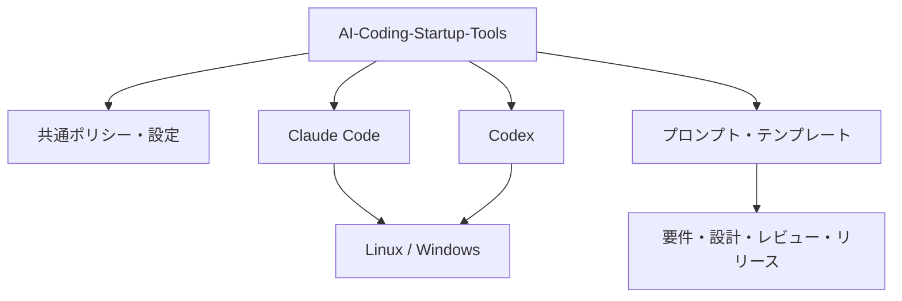
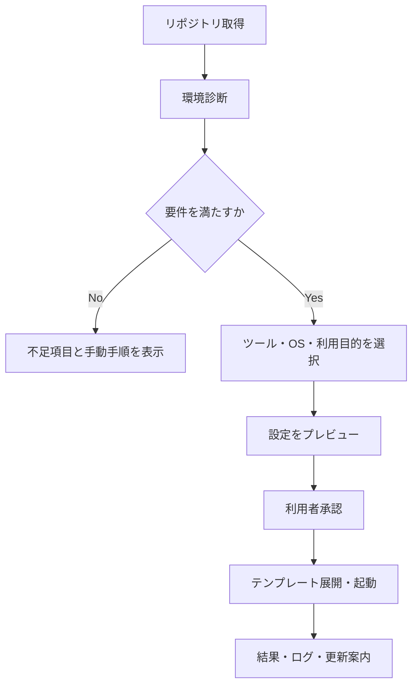

# AI Coding Startup Tools 要件定義書

| 項目 | 内容 |
|---|---|
| 文書名 | AI Coding Startup Tools 要件定義書 |
| プロジェクト名 | **AI Coding Startup Tools** |
| GitHubリポジトリ名 | `AI-Coding-Startup-Tools` |
| 文書版 | 1.0 |
| 作成日 | 2026-08-04 |
| 対象利用者 | 社内開発者、IT・DX部門、リポジトリ管理者、レビュー担当者 |
| 対象AIコーディングツール | Claude Code、Codex |
| 対象OS | Linux（主運用）、Windows（個人検証・開発補助） |
| 機密区分 | 社内利用（秘密情報・会社データは格納禁止） |

---

## 1. プロジェクト概要

### 1.1 背景

Claude Code／Codexの起動方法、初期設定、プロンプト、スクリプト、開発テンプレートがOS別・ツール別の複数リポジトリに分散している。分散状態では、同じ設定の重複管理、手順差異、更新漏れ、古いテンプレートの再利用、セキュリティ基準の不統一が発生しやすい。

本プロジェクトでは、これらを単一リポジトリへ統合し、社内開発者が安全かつ再現可能な方法でAIコーディング環境を準備・起動・運用できる共通基盤を整備する。

### 1.2 目的

1. Claude Code／Codexの起動・初期設定を標準化する。
2. Linux／Windows間の共通部分とOS固有部分を明確に分離する。
3. 要件定義、設計、レビュー、リリース用プロンプト・テンプレートを一元管理する。
4. 開発開始までの時間と設定ミスを削減する。
5. 秘密情報の混入、危険な自動実行、意図しない本番操作を防止する。
6. テンプレートとスクリプトの品質をCIで継続的に検証する。
7. 統合元リポジトリの由来と移行判断を追跡可能にする。

### 1.3 本システムの位置づけ

本リポジトリは業務データを処理するWebサービスではなく、AI支援開発のための「配布可能な開発者ツールキット」である。GitHubをコードおよび文書の正本とし、ローカル環境には利用に必要なコピーだけを配置する。



---

## 2. 統合対象

| 統合元リポジトリ | 主な移行対象 | 統合先 |
|---|---|---|
| `Claude-StartUpTools-New-Linux` | Linux用起動・セットアップ処理 | `claude-code/linux`、`scripts` |
| `Claude-StartUpTools-New-Windows` | Windows用起動・PowerShell処理 | `claude-code/windows`、`scripts` |
| `ClaudeCode-StartUpTools-New` | Claude Code共通設定・起動手順 | `claude-code/common` |
| `Codex-StartUpTools` | Codex初期資産 | `codex/common`、履歴資料 |
| `Codex-StartUpTools-New-Linux` | Linux用Codex処理 | `codex/linux`、`scripts` |
| `Codex-StartUpTools-New-Windows` | Windows用Codex処理 | `codex/windows`、`scripts` |
| `ClaudeCode-System-Development-Documents` | 開発標準、文書・プロンプト雛形 | `templates`、`prompts`、`docs` |

### 2.1 統合原則

- ファイル名が同じでも自動的に上書きせず、内容・更新日・利用実績を比較する。
- 統合元、元パス、移行先、採否理由を`docs/migration/inventory.yml`へ記録する。
- 重複資産は共通化し、OS固有差分だけをLinux／Windows配下に残す。
- 廃止予定の資産は即時削除せず、移行検証完了まで`docs/migration/archive-map.md`で追跡する。
- 統合元リポジトリのアーカイブまたは削除は、移行完了判定と承認後に別作業として行う。

---

## 3. スコープ

### 3.1 対象範囲

- 環境診断、依存関係確認、初期設定支援
- Claude Code／Codexの安全な起動支援
- Linux用Shellスクリプト、Windows用PowerShellスクリプト
- 共通プロンプト、ツール別プロンプト、開発フェーズ別テンプレート
- `AGENTS.md`、`CLAUDE.md`等の雛形および配置支援
- プロジェクト初期化、テンプレート展開、設定検証
- Markdown、YAML、JSON、Shell、PowerShellの静的検査
- バージョン・変更履歴・互換性情報の管理
- 統合元資産の棚卸し、移行マッピング、重複排除
- 利用者向け導入、更新、トラブルシューティング文書

### 3.2 対象外

- Claude Code、Codex本体の再配布
- AIサービスの契約・課金・アカウント発行
- APIキー、アクセストークン、証明書、個人情報、会社業務データの保管
- 本番環境への自動デプロイや無承認の外部書込み
- AD、Entra ID、HENNGE ONE、FortiGate等の会社基盤の直接管理
- AI生成コードの正しさ・法的適合性の自動保証
- WebUI、常駐サーバ、データベースの初期リリースでの提供

---

## 4. 利用者と権限

| ロール | 主な操作 |
|---|---|
| 利用者 | 導入、診断、テンプレート展開、AIツール起動、文書参照 |
| コントリビューター | スクリプト・プロンプト・文書の変更、テスト追加、PR作成 |
| レビュアー | セキュリティ、OS互換性、プロンプト動作、文書整合性の確認 |
| メンテナー | リリース、互換性表更新、保護ブランチ管理、移行完了判定 |
| リポジトリ管理者 | 権限、ルールセット、Secrets、緊急停止・廃止の管理 |

最小権限を原則とし、`main`への直接pushは禁止する。変更はPull Request、CI、レビューを経て反映する。

---

## 5. 業務・利用フロー



スクリプトは既定で診断またはプレビューモードとし、ファイル変更、パッケージ導入、外部通信を伴う処理は明示的なオプションと確認を必要とする。

---

## 6. 機能要件

### 6.1 共通管理

| ID | 要件 | 優先度 | 受入条件 |
|---|---|---:|---|
| FR-COM-001 | 共通ポリシー、命名規則、ログ方針を一元管理できる | Must | ツール・OS固有資産から共通規則を参照できる |
| FR-COM-002 | 対応OS、Shell、PowerShell、AI CLIの互換性を管理できる | Must | `compatibility.yml`に対応範囲が記載される |
| FR-COM-003 | 設定値の優先順位を文書化する | Must | CLI引数、環境変数、利用者設定、既定値の順序が明確 |
| FR-COM-004 | バージョンと変更履歴を管理する | Must | SemVerタグとCHANGELOGが一致する |

### 6.2 環境診断・初期設定

| ID | 要件 | 優先度 | 受入条件 |
|---|---|---:|---|
| FR-SET-001 | OS、アーキテクチャ、Shell、Git、Node.js、対象CLIを検出する | Must | 結果が成功・警告・失敗で表示される |
| FR-SET-002 | 必須／推奨バージョンを判定する | Must | 非対応版では理由と是正方法を表示する |
| FR-SET-003 | 設定変更前に差分をプレビューする | Must | `--dry-run`で書込みが発生しない |
| FR-SET-004 | 既存設定をバックアップしてから更新する | Must | 復元可能なバックアップが生成される |
| FR-SET-005 | 再実行しても設定が重複・破損しない | Must | 同一条件で2回実行した結果が同等となる |
| FR-SET-006 | 管理者権限が必要な処理を事前に表示する | Must | 無断昇格を行わない |

### 6.3 Claude Code／Codex起動支援

| ID | 要件 | 優先度 | 受入条件 |
|---|---|---:|---|
| FR-RUN-001 | ツール、OS、作業ディレクトリ、プロファイルを指定して起動できる | Must | 不正なパス・未初期化環境を検知する |
| FR-RUN-002 | 起動前にリポジトリ状態と指示ファイルを確認する | Must | dirty状態、適用指示、対象ブランチを表示する |
| FR-RUN-003 | 危険なオプションを既定で無効化する | Must | 全権限・無確認実行は明示指定なしに有効化されない |
| FR-RUN-004 | 利用したプロファイルと実行結果をローカルログへ記録する | Should | 秘密値をマスキングしたログが残る |
| FR-RUN-005 | CLI未導入時は公式導入先と手順を案内する | Should | 非公式バイナリを自動取得しない |

### 6.4 プロンプト管理

| ID | 要件 | 優先度 | 受入条件 |
|---|---|---:|---|
| FR-PRM-001 | 共通、Claude Code固有、Codex固有のプロンプトを分離する | Must | メタデータで対象ツールを識別できる |
| FR-PRM-002 | 調査、計画、実装、検証、レビュー、リリース段階を管理する | Must | 各段階に目的・入力・停止条件・成果物がある |
| FR-PRM-003 | 変数を安全に置換し、未解決変数を検出する | Must | 未解決時は起動前に停止する |
| FR-PRM-004 | 自律実行プロンプトに安全境界と承認点を含める | Must | 本番反映、mainマージ、削除、課金操作は停止条件となる |
| FR-PRM-005 | プロンプトの変更理由と評価結果を記録する | Should | PRに評価記録が添付される |

### 6.5 開発テンプレート

| ID | 要件 | 優先度 | 受入条件 |
|---|---|---:|---|
| FR-TPL-001 | 要件定義、設計、レビュー、リリースの雛形を提供する | Must | 4分類すべてにREADMEと雛形が存在する |
| FR-TPL-002 | プロジェクト名等の変数から初期文書を生成できる | Must | 必須変数不足時は生成しない |
| FR-TPL-003 | 生成前に出力予定と衝突を表示する | Must | 既存ファイルを無断上書きしない |
| FR-TPL-004 | 日本語を標準とし、必要に応じ英語併記できる | Should | UTF-8で文字化けしない |

### 6.6 統合・移行管理

| ID | 要件 | 優先度 | 受入条件 |
|---|---|---:|---|
| FR-MIG-001 | 7リポジトリの全資産を棚卸しする | Must | 各資産に出典、採否、移行先、状態がある |
| FR-MIG-002 | 重複・競合・秘密情報・旧仕様を検出する | Must | 検出結果がレビュー可能なレポートになる |
| FR-MIG-003 | Linux／Windows双方で代表シナリオを移行検証する | Must | 受入試験に合格するまで統合元を廃止しない |
| FR-MIG-004 | 統合元の廃止判定資料を作成する | Must | 残課題、参照先、ロールバック方法が明記される |

---

## 7. 非機能要件

### 7.1 セキュリティ

- APIキー、トークン、Cookie、秘密鍵、実値入り`.env`をGitへ保存しない。
- 秘密情報はOS資格情報ストア、環境変数、GitHub Secrets等の承認済み保管先を利用する。
- secret scanning、依存関係検査、Shell／PowerShell静的解析をCIで実施する。
- 外部から取得するファイルは公式配布元、TLS、可能な場合はハッシュまたは署名で検証する。
- スクリプト内の`curl | sh`、`Invoke-Expression`、資格情報のコマンドライン露出を禁止する。
- ログには秘密値、プロンプト本文中の機密情報、ホームディレクトリ全体等を記録しない。
- 削除、上書き、権限変更、外部送信、本番操作は明示承認を必要とする。

### 7.2 信頼性・保守性

| ID | 要件 | 目標 |
|---|---|---|
| NFR-REL-001 | 冪等性 | 同一設定の再実行で重複変更なし |
| NFR-REL-002 | ロールバック | 設定変更をバックアップから復元可能 |
| NFR-MNT-001 | 可読性 | ShellCheck/PSScriptAnalyzer等の基準を満たす |
| NFR-MNT-002 | 追跡性 | 要件IDとテストIDを対応付ける |
| NFR-MNT-003 | 後方互換 | 破壊的変更はメジャーバージョンで通知 |

### 7.3 性能・可用性

- ローカル環境診断は通常環境で30秒以内を目標とする（ネットワーク待ちを除く）。
- テンプレート生成は100ファイル規模で10秒以内を目標とする。
- オフラインでも診断、既存テンプレート閲覧、ローカル生成を利用可能とする。
- 外部サービス障害時は設定を破損させず、再試行方法を表示する。

### 7.4 対応環境

- Linux：Ubuntu LTSを優先サポートし、会社検証・常時稼働環境の主系とする。
- Windows：Windows 11およびPowerShell 7を優先し、個人検証・開発補助用途とする。
- Bash、PowerShell、Git、Node.js等の厳密な対応版は`common/config/compatibility.yml`で管理する。
- WSLはLinux互換プロファイルとして扱い、Windowsネイティブとの差異を明記する。

### 7.5 ユーザビリティ

- エラーは「原因・影響・修正方法・再実行方法」を日本語で表示する。
- 色だけに依存せず、記号と文言で状態を識別できるようにする。
- 初心者向けクイックスタートと管理者向け詳細手順を分離する。
- `--help`、`--version`、`--dry-run`、非対話モードを提供する。

---

## 8. データ・設定要件

### 8.1 管理対象

| 種別 | 形式 | 例 |
|---|---|---|
| 互換性情報 | YAML | OS、CLI、Shell、Node.jsの対応版 |
| プロファイル | YAML | ツール、OS、起動引数、安全設定 |
| プロンプト | Markdown + YAML Front Matter | 対象、段階、変数、停止条件 |
| テンプレート | Markdown/YAML/JSON | 要件定義、設計、レビュー、リリース |
| 移行台帳 | YAML | 出典、ハッシュ、採否、移行先、状態 |
| 実行ログ | JSON Linesまたはテキスト | 時刻、処理、結果、バージョン |

設定ファイルはJSON Schemaまたは同等のスキーマで検証する。利用者固有設定と生成ログは原則としてGit管理対象外とする。

### 8.2 設定優先順位

1. 明示的なCLI引数
2. 許可された環境変数
3. プロジェクト設定
4. 利用者ローカル設定
5. リポジトリ既定値

秘密値は設定ファイルに直書きせず、参照名だけを保持する。

---

## 9. 推奨リポジトリ構成

```text
AI-Coding-Startup-Tools/
├─ common/
├─ claude-code/
│  ├─ common/
│  ├─ linux/
│  └─ windows/
├─ codex/
│  ├─ common/
│  ├─ linux/
│  └─ windows/
├─ scripts/
├─ prompts/
├─ templates/
│  ├─ requirements/
│  ├─ design/
│  ├─ review/
│  └─ release/
├─ tests/
├─ docs/
└─ .github/
```

提示された推奨構成を維持しつつ、品質保証に必要な`tests`と`.github`を追加する。

---

## 10. 運用・変更管理要件

- GitHub Flowを採用し、機能ブランチからPull Requestを作成する。
- `main`は保護し、必須CI、1名以上のレビュー、会話解決、最新化をマージ条件とする。
- CODEOWNERSでShell、PowerShell、プロンプト、セキュリティ関連の責任範囲を定義する。
- リリースはSemVerを採用し、タグ、CHANGELOG、リリースノートを作成する。
- AIツールの仕様変更を定期確認し、互換性表と非推奨情報を更新する。
- 障害時は該当バージョンを非推奨化し、既知問題、回避策、修正版を通知する。

---

## 11. 移行計画

| フェーズ | 内容 | 完了条件 |
|---|---|---|
| Phase 0 | 統合元の凍結・バックアップ・棚卸し | 7リポジトリの資産台帳完成 |
| Phase 1 | 共通資産の抽出と重複比較 | 採否・出典・移行先が確定 |
| Phase 2 | Claude Code資産の統合 | Linux／Windows代表試験合格 |
| Phase 3 | Codex資産の統合 | Linux／Windows代表試験合格 |
| Phase 4 | 文書・プロンプト・テンプレート統合 | スキーマ検査・レビュー合格 |
| Phase 5 | CI、セキュリティ、受入試験 | Must要件と必須CIが合格 |
| Phase 6 | v1.0公開・利用者移行 | クイックスタートで再現可能 |
| Phase 7 | 統合元のアーカイブ判定 | 承認、参照先、復元方法が確定 |

---

## 12. 受入基準

1. すべてのMust要件が実装・検証されている。
2. Ubuntu LTSとWindows 11で、診断→プレビュー→初期化→起動の代表フローが成功する。
3. 2回連続実行しても設定重複や既存ファイル破損がない。
4. `--dry-run`でファイル・OS設定・外部サービスへの変更が発生しない。
5. 秘密情報検査、Shell／PowerShell解析、Markdown／YAML検査、テストが合格する。
6. Claude Code／Codex双方でプロンプト変数と停止条件が正しく機能する。
7. 要件・設計・レビュー・リリースの4テンプレートが生成できる。
8. 統合した全資産について出典と採否を追跡できる。
9. README、導入手順、ロールバック、トラブルシューティングが整備されている。
10. mainマージ、本番操作、破壊的変更が無承認で実行されない。

---

## 13. リスクと対策

| リスク | 影響 | 対策 |
|---|---|---|
| 統合時の新旧ファイル取り違え | 不具合・機能後退 | ハッシュ、更新履歴、動作試験を用いた比較 |
| AI CLIの仕様変更 | 起動不能・設定不整合 | 互換性表、バージョン固定、定期試験 |
| 秘密情報のコミット | 情報漏えい | pre-commit、secret scanning、レビュー |
| 強すぎる自律実行設定 | 破壊的操作・外部変更 | 安全既定値、dry-run、承認ゲート |
| OS差異 | 一方のOSだけ失敗 | 共通ロジック分離、OS別CI、代表E2E |
| プロンプト肥大化・陳腐化 | 品質低下・意図逸脱 | メタデータ、評価ケース、版管理、廃止期限 |
| 統合元の早期削除 | 復元不能 | 段階移行、アーカイブ、承認後廃止 |

---

## 14. 将来拡張

- 対話型セットアップUIまたはTUI
- 開発プロジェクトの構成診断・準拠スコア
- テンプレートカタログと社内配布パッケージ
- プロンプト評価の自動回帰テスト
- VS Code／Dev Container連携
- Linux側管理基盤からの更新通知
- CMDB-DocKit等の文書生成基盤との選択的連携

将来拡張でも秘密情報を集中保管する設計や、無承認の本番操作は採用しない。

---

## 15. 用語

| 用語 | 定義 |
|---|---|
| プロファイル | ツール、OS、起動引数、安全設定をまとめた設定単位 |
| dry-run | 変更内容を表示するが実際の書込みを行わない実行方式 |
| 冪等性 | 同じ処理を繰り返しても結果が不要に変化しない性質 |
| 統合元 | 本リポジトリへ資産を移行する既存リポジトリ |
| 承認ゲート | 破壊的・外部・本番操作の前に人の確認を必須とする境界 |
| 正本 | 管理上の唯一の基準となる保存場所。本プロジェクトではGitHubリポジトリ |

