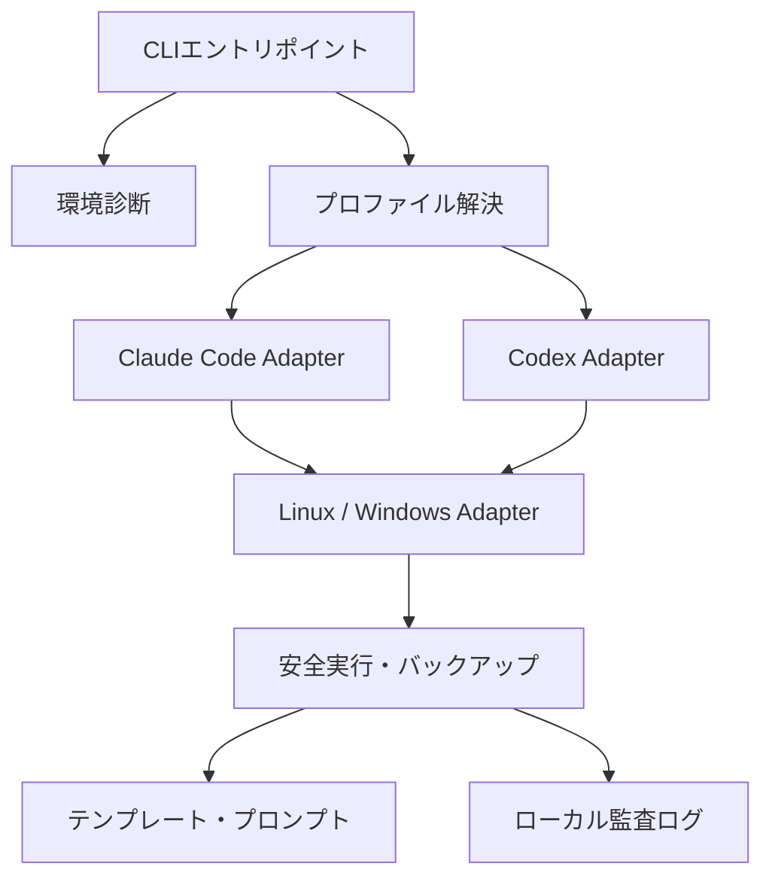
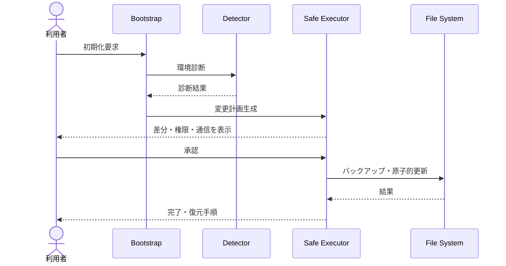

# AI Coding Startup Tools 詳細設計仕様書

| 項目 | 内容 |
|---|---|
| 文書名 | AI Coding Startup Tools 詳細設計仕様書 |
| プロジェクト名 | **AI Coding Startup Tools** |
| GitHubリポジトリ名 | `AI-Coding-Startup-Tools` |
| 文書版 | 1.0 |
| 作成日 | 2026-08-04 |
| 対応要件 | `AI-Coding-Startup-Tools_要件定義書.md` v1.0 |
| 実装方式 | Bash、PowerShell 7、Markdown、YAML、JSON Schema、GitHub Actions |

---

## 1. 設計方針

### 1.1 基本原則

1. GitHubをコード・設定雛形・文書の正本とする。
2. 共通ロジック、ツール固有ロジック、OS固有ロジックを分離する。
3. 既定動作は読取り・診断・プレビューとする。
4. 変更前バックアップ、原子的更新、冪等性、ロールバックを必須とする。
5. 秘密情報を引数・設定ファイル・ログ・Gitへ残さない。
6. 外部通信、パッケージ導入、上書き、削除、権限昇格を明示する。
7. プロンプトもコードとして版管理、構文検査、回帰評価する。
8. 統合元資産の出典と変更履歴を保持する。

### 1.2 論理アーキテクチャ



---

## 2. 物理ディレクトリ設計

```text
AI-Coding-Startup-Tools/
├─ README.md
├─ CHANGELOG.md
├─ LICENSE
├─ SECURITY.md
├─ CONTRIBUTING.md
├─ AGENTS.md
├─ CLAUDE.md
├─ common/
│  ├─ config/
│  │  ├─ defaults.yml
│  │  ├─ compatibility.yml
│  │  └─ logging.yml
│  ├─ schemas/
│  │  ├─ profile.schema.json
│  │  ├─ prompt.schema.json
│  │  ├─ compatibility.schema.json
│  │  └─ migration-inventory.schema.json
│  └─ policies/
│     ├─ safety.md
│     ├─ secrets.md
│     └─ approvals.md
├─ claude-code/
│  ├─ common/
│  │  ├─ profiles/
│  │  ├─ prompts/
│  │  └─ config.example.yml
│  ├─ linux/
│  │  ├─ install-check.sh
│  │  └─ launch.sh
│  └─ windows/
│     ├─ Install-Check.ps1
│     └─ Start-ClaudeCode.ps1
├─ codex/
│  ├─ common/
│  │  ├─ profiles/
│  │  ├─ prompts/
│  │  └─ config.example.yml
│  ├─ linux/
│  │  ├─ install-check.sh
│  │  └─ launch.sh
│  └─ windows/
│     ├─ Install-Check.ps1
│     └─ Start-Codex.ps1
├─ scripts/
│  ├─ linux/
│  │  ├─ bootstrap.sh
│  │  ├─ diagnose.sh
│  │  ├─ render-template.sh
│  │  └─ lib/
│  ├─ windows/
│  │  ├─ Bootstrap.ps1
│  │  ├─ Test-Environment.ps1
│  │  ├─ New-ProjectFromTemplate.ps1
│  │  └─ Modules/
│  └─ validation/
│     ├─ validate-config.mjs
│     ├─ validate-prompts.mjs
│     └─ validate-migration.mjs
├─ prompts/
│  ├─ common/
│  ├─ claude-code/
│  ├─ codex/
│  └─ examples/
├─ templates/
│  ├─ requirements/
│  ├─ design/
│  ├─ review/
│  └─ release/
├─ tests/
│  ├─ unit/
│  ├─ integration/
│  ├─ fixtures/
│  ├─ bats/
│  └─ pester/
├─ docs/
│  ├─ architecture/
│  ├─ guides/
│  ├─ migration/
│  │  ├─ inventory.yml
│  │  ├─ conflict-report.md
│  │  └─ archive-map.md
│  ├─ adr/
│  └─ troubleshooting/
└─ .github/
   ├─ workflows/
   │  ├─ ci.yml
   │  ├─ security.yml
   │  └─ release.yml
   ├─ CODEOWNERS
   ├─ pull_request_template.md
   └─ dependabot.yml
```

---

## 3. コンポーネント設計

| ID | コンポーネント | 責務 | 主な入出力 |
|---|---|---|---|
| CMP-01 | Environment Detector | OS、Shell、CLI、依存関係の検出 | 環境情報→診断結果 |
| CMP-02 | Profile Resolver | 設定優先順位、既定値、変数を解決 | YAML＋引数→確定設定 |
| CMP-03 | Claude Adapter | Claude Code固有設定と起動 | 確定設定→CLIプロセス |
| CMP-04 | Codex Adapter | Codex固有設定と起動 | 確定設定→CLIプロセス |
| CMP-05 | OS Adapter | Bash／PowerShell差異を吸収 | 共通要求→OS操作 |
| CMP-06 | Safe Executor | dry-run、確認、バックアップ、原子的更新 | 操作計画→実行結果 |
| CMP-07 | Prompt Manager | メタデータ検証、変数置換、選択 | MD＋変数→プロンプト |
| CMP-08 | Template Renderer | 雛形検証、衝突検知、文書生成 | 雛形＋変数→成果物 |
| CMP-09 | Audit Logger | 秘密値除去、構造化ログ | イベント→ローカルログ |
| CMP-10 | Migration Registry | 統合元資産と採否の追跡 | 棚卸し→移行台帳 |

### 3.1 依存方向

- ツール固有層は共通層を参照してよい。
- OS固有層は共通インターフェースを実装する。
- 共通層からClaude Code／Codex固有層を直接参照しない。
- テンプレートとプロンプトは実行スクリプトへ依存しない。
- 検証スクリプトは配布資産を読取り専用で検査する。

---

## 4. CLI設計

### 4.1 統一コマンド体系

初期実装はOS別エントリポイントを提供し、サブコマンドとオプション名を揃える。

| 操作 | Linux | Windows |
|---|---|---|
| 環境診断 | `./scripts/linux/diagnose.sh` | `./scripts/windows/Test-Environment.ps1` |
| 初期化 | `./scripts/linux/bootstrap.sh` | `./scripts/windows/Bootstrap.ps1` |
| Claude起動 | `./claude-code/linux/launch.sh` | `./claude-code/windows/Start-ClaudeCode.ps1` |
| Codex起動 | `./codex/linux/launch.sh` | `./codex/windows/Start-Codex.ps1` |
| 雛形生成 | `./scripts/linux/render-template.sh` | `./scripts/windows/New-ProjectFromTemplate.ps1` |

### 4.2 共通オプション

| オプション | 型 | 既定値 | 説明 |
|---|---|---|---|
| `--profile` / `-Profile` | string | `safe` | 利用プロファイル |
| `--project-dir` / `-ProjectDirectory` | path | 現在位置 | 対象プロジェクト |
| `--dry-run` / `-WhatIf` | bool | true（初期化） | 変更予定のみ表示 |
| `--yes` / `-Confirm:$false` | bool | false | 許可された確認だけ省略 |
| `--non-interactive` / `-NonInteractive` | bool | false | CI等の非対話実行 |
| `--verbose` / `-Verbose` | bool | false | 詳細ログ |
| `--json` / `-AsJson` | bool | false | 機械可読出力 |
| `--version` | bool | - | ツールキット版表示 |
| `--help` | bool | - | ヘルプ表示 |

`--yes`を指定しても、mainへのマージ、本番デプロイ、外部への送信、再帰削除、Secrets変更などの高リスク操作は自動承認しない。

### 4.3 終了コード

| コード | 意味 |
|---:|---|
| 0 | 成功 |
| 1 | 一般エラー |
| 2 | 引数・設定不正 |
| 3 | 依存関係不足・非互換 |
| 4 | 利用者キャンセル・承認待ち |
| 5 | セキュリティポリシー違反 |
| 6 | ファイル競合 |
| 7 | 外部サービス一時障害 |
| 10 | 部分成功（警告あり） |

---

## 5. 設定設計

### 5.1 `defaults.yml`

```yaml
schemaVersion: 1
defaultProfile: safe
locale: ja-JP
execution:
  dryRunByDefault: true
  requireConfirmation:
    - file_overwrite
    - package_install
    - privilege_escalation
    - external_write
logging:
  level: info
  format: jsonl
  redact: true
```

### 5.2 `compatibility.yml`

```yaml
schemaVersion: 1
platforms:
  linux:
    distributions:
      - name: ubuntu
        versions: ["24.04"]
    shells:
      bash: ">=5.1"
  windows:
    versions: ["11"]
    powershell: ">=7.4"
dependencies:
  git: ">=2.43"
  node: ">=20 <25"
tools:
  claudeCode:
    policy: tested-range
  codex:
    policy: tested-range
```

実際の対応バージョンはCI検証後に更新し、例示値を未検証のまま正式値として公開しない。

### 5.3 プロファイル

```yaml
schemaVersion: 1
id: safe
tool: codex
platforms: [linux, windows]
execution:
  approvalMode: explicit
  allowNetwork: false
  allowExternalWrite: false
  allowDestructive: false
prompt:
  default: common/implementation-safe.md
```

### 5.4 設定解決処理

```text
CLI引数
  > 許可済み環境変数
  > プロジェクト設定
  > 利用者ローカル設定
  > defaults.yml
```

処理手順：読み込み→スキーマ検証→未知キー検出→優先順位でマージ→秘密値参照を解決→安全ポリシー適用→確定設定の要約表示。安全ポリシーより弱い値は利用者設定で上書きできない。

---

## 6. プロンプト設計

### 6.1 ファイル形式

```markdown
---
schemaVersion: 1
id: implementation-safe
title: 安全な実装継続
targets: [claude-code, codex]
phase: implementation
variables:
  - PROJECT_NAME
  - COMPLETION_CRITERIA
approvalGates:
  - production_deploy
  - merge_main
  - destructive_change
updatedAt: 2026-08-04
---

# 目的
{{PROJECT_NAME}}を、既存方針と整合させて実装してください。

# 完了条件
{{COMPLETION_CRITERIA}}
```

### 6.2 必須メタデータ

| 項目 | 必須 | 制約 |
|---|---:|---|
| `schemaVersion` | Yes | 対応スキーマ版 |
| `id` | Yes | kebab-case、一意 |
| `title` | Yes | 1～100文字 |
| `targets` | Yes | `claude-code`、`codex`の配列 |
| `phase` | Yes | discovery/plan/implementation/verify/review/release |
| `variables` | Yes | 未使用・未解決を禁止 |
| `approvalGates` | Yes | 高リスク操作を列挙 |
| `updatedAt` | Yes | ISO 8601日付 |

### 6.3 レンダリング処理

1. 対象ファイルのパスを許可ルート内に正規化する。
2. Front Matterを解析しスキーマ検証する。
3. 対象ツールとフェーズの整合を確認する。
4. 変数名を許可リストと照合する。
5. 値を文字列として安全に置換する。式評価やShell展開は行わない。
6. 未解決変数、未知変数、空の必須値があれば停止する。
7. 承認ゲートを利用者へ表示する。
8. レンダリング結果を標準出力または指定ファイルへ出力する。

プロンプト本文をShellの`eval`、PowerShellの`Invoke-Expression`へ渡してはならない。

---

## 7. テンプレート設計

### 7.1 分類

| ディレクトリ | 代表成果物 | 必須項目 |
|---|---|---|
| `requirements` | 要件定義書 | 目的、スコープ、機能、非機能、受入基準 |
| `design` | 基本・詳細設計書 | 構成、処理、データ、セキュリティ、テスト |
| `review` | 評価・レビュー票 | 評価軸、根拠、重大度、是正、判定 |
| `release` | リリース計画・判定票 | 変更、移行、ロールバック、監視、承認 |

### 7.2 テンプレートマニフェスト

```yaml
schemaVersion: 1
id: requirements-standard-ja
version: 1.0.0
entrypoint: template.md
output: "{{PROJECT_SLUG}}_要件定義書.md"
requiredVariables:
  - PROJECT_NAME
  - PROJECT_SLUG
conflictPolicy: fail
encoding: utf-8
```

### 7.3 生成時の安全制御

- 出力先を正規化し、プロジェクトルート外へのパストラバーサルを拒否する。
- シンボリックリンク経由のルート外書込みを拒否する。
- 既存ファイルがある場合は既定で終了コード6とし、差分だけを表示する。
- `--force`相当はバックアップ作成と個別確認を必須とする。
- 一時ファイルへ書き込み、検証成功後に同一ファイルシステム上で置換する。
- UTF-8、LFを標準とし、Windowsスクリプトは`.gitattributes`で必要な改行を制御する。

---

## 8. 初期化・起動処理設計

### 8.1 初期化シーケンス



### 8.2 共通疑似コード

```text
validate_arguments()
assert_project_path_is_safe()
environment = detect_environment()
config = resolve_and_validate_config()
plan = build_change_plan(environment, config)
print_plan_with_risk_labels(plan)

if dry_run:
    exit SUCCESS

require_approval(plan)
backup = create_backup(plan.targets)
try:
    apply_atomically(plan)
    verify_postconditions(plan)
    write_redacted_audit_log(SUCCESS)
catch:
    restore(backup)
    write_redacted_audit_log(FAILURE)
    exit GENERAL_ERROR
```

### 8.3 起動前チェック

- 対象ディレクトリが存在し、許可されたプロジェクトルート内である。
- Gitリポジトリの場合、ブランチ、dirty状態、リモートURLを表示する。
- `AGENTS.md`、`AGENTS.override.md`、`CLAUDE.md`等の存在を表示する。
- 対象CLIの存在と互換性を確認する。
- 選択プロンプトの対象ツール、未解決変数、承認ゲートを確認する。
- 対話端末でない場合に対話確認が必要なら終了コード4で停止する。

### 8.4 プロセス起動

- 引数は文字列連結せず配列として渡す。
- Shell経由の二重解釈を避ける。
- 終了シグナルを子プロセスへ適切に転送する。
- 子プロセスの終了コードを保持する。
- APIキーなどの環境変数値をログに出力しない。
- 作業ディレクトリを明示し、存在確認後に移動する。

---

## 9. ファイル・バックアップ設計

### 9.1 変更計画モデル

```yaml
operationId: 20260804T090000Z-ab12cd34
mode: dry-run
actions:
  - type: create
    target: .agent-config/profile.yml
    source: claude-code/common/config.example.yml
    risk: low
  - type: replace
    target: CLAUDE.md
    backupRequired: true
    risk: medium
```

### 9.2 バックアップ

- 保存先：対象プロジェクト内の`.ai-startup-tools/backups/<operation-id>/`
- 管理情報：元パス、サイズ、SHA-256、権限、更新時刻、復元状態
- `.ai-startup-tools/`は既定の`.gitignore`対象とする。
- バックアップ保持数は既定5世代とし、削除前に対象を表示する。
- ルート、ホーム全体、ワークスペース全体を再帰対象に指定できないようにする。

### 9.3 原子的更新

同一ディレクトリ内に一時ファイルを作成し、内容検証、`fsync`相当、権限反映後にrenameで置換する。Windowsでロック中の場合は既存ファイルを保持して停止し、強制削除しない。

---

## 10. ログ・監査設計

### 10.1 ログ形式

```json
{"timestamp":"2026-08-04T00:00:00Z","level":"info","operationId":"...","component":"bootstrap","action":"plan","target":"CLAUDE.md","result":"dry-run","toolkitVersion":"1.0.0"}
```

### 10.2 記録項目

- UTCタイムスタンプ、操作ID、ツールキット版
- OS種別、対象ツール、プロファイルID
- 操作種別、相対対象パス、結果、終了コード
- 警告・エラーコード、処理時間

### 10.3 禁止項目

- APIキー、アクセストークン、Cookie、秘密鍵
- 環境変数の全量
- プロンプトへ入力された機密本文
- 個人名、メールアドレス等の不要な個人情報
- 認証ヘッダー、署名付きURL

キー名パターンと値パターンの双方でマスキングし、ログ記録失敗を理由に本処理を無制限継続しない。高リスク処理では監査ログ作成不能時に停止する。

---

## 11. セキュリティ詳細設計

### 11.1 脅威と制御

| 脅威 | 制御 |
|---|---|
| 秘密情報の誤コミット | `.gitignore`、gitleaks等、pre-commit、CI、レビュー |
| 悪意あるテンプレート | スキーマ、許可ルート、式評価禁止、CODEOWNERS |
| コマンドインジェクション | 引数配列、入力許可リスト、`eval`禁止 |
| パストラバーサル | canonical path検証、シンボリックリンク検査 |
| サプライチェーン攻撃 | 公式配布元、バージョン固定、ハッシュ／署名、Dependabot |
| 過剰権限 | 標準権限、必要時の個別昇格、権限理由表示 |
| 危険なAI自律操作 | 安全プロファイル、承認ゲート、外部書込み既定拒否 |
| ログ漏えい | マスキング、ローカル保存、保持制限、Git除外 |

### 11.2 禁止実装

- `curl ... | sh`、`wget ... | bash`
- `Invoke-Expression`による取得コード実行
- APIキーをCLI引数に含める実装
- TLS検証の無効化
- 未検証の再帰削除、ワイルドカード削除
- `main`への自動マージ、本番デプロイ、課金操作の無確認実行
- `.env`実値ファイル、秘密鍵、認証キャッシュのテンプレート同梱

### 11.3 GitHub設定

- Branch protection／Rulesets：PR必須、必須チェック、force push禁止、削除禁止
- CODEOWNERS：`scripts/**`、`.github/**`、`common/policies/**`はメンテナー承認必須
- GitHub Actionsは最小`permissions`を明記し、原則`contents: read`
- 外部ActionsはコミットSHA固定を推奨する
- Secretsは環境別に分離し、fork由来PRへ渡さない

---

## 12. 統合移行設計

### 12.1 棚卸しレコード

```yaml
schemaVersion: 1
assets:
  - sourceRepository: Claude-StartUpTools-New-Linux
    sourcePath: scripts/start.sh
    sourceCommit: "<full-commit-sha>"
    sha256: "<content-hash>"
    category: launcher
    targetPath: claude-code/linux/launch.sh
    decision: merge
    status: verified
    reason: Linux固有起動処理として採用
    tests: [IT-CLAUDE-LINUX-001]
```

### 12.2 競合判定

| 判定 | 条件 | 処理 |
|---|---|---|
| identical | SHA-256一致 | 1件だけ採用し出典を複数記録 |
| semantic-duplicate | 目的同一・実装差異 | テスト比較後に共通化 |
| platform-specific | OS固有差分 | 対応OS配下へ分離 |
| tool-specific | Claude/Codex固有 | 対象ツール配下へ分離 |
| obsolete | 旧CLI・旧仕様のみ | 採用せず理由と代替先を記録 |
| sensitive | 秘密値・会社データを含む | 移行禁止、履歴浄化を別途判断 |
| unresolved | 判断材料不足 | 隔離し、v1.0対象外とする |

### 12.3 移行手順

1. 各統合元の既定ブランチとコミットSHAを固定する。
2. ファイル一覧、サイズ、ハッシュ、Git履歴、ライセンス、秘密情報を収集する。
3. 自動重複検出後、人が意味的重複と採否をレビューする。
4. 共通→ツール固有→OS固有の順に配置する。
5. 元の挙動をfixturesとテストへ記録する。
6. Linux／Windowsで移行前後の代表動作を比較する。
7. 台帳を`verified`へ更新し、参照先を文書化する。
8. 全利用者移行後、統合元のread-onlyアーカイブを提案する。
9. 削除が必要な場合は別承認と復元可能なバックアップを必須とする。

---

## 13. CI/CD設計

### 13.1 Pull Request CI


| Job | Runner | 主な検査 |
|---|---|---|
| `lint-docs-config` | Ubuntu | markdownlint、yamllint、JSON Schema |
| `lint-shell` | Ubuntu | ShellCheck、shfmt check |
| `test-shell` | Ubuntu | Bats、dry-run、冪等性 |
| `lint-powershell` | Windows | PSScriptAnalyzer |
| `test-powershell` | Windows | Pester、WhatIf、冪等性 |
| `validate-prompts` | Ubuntu | Front Matter、変数、承認ゲート |
| `security` | Ubuntu | secret scan、依存関係検査 |
| `migration-registry` | Ubuntu | 台帳スキーマ、出典、重複状態 |

### 13.2 リリース

1. `main`の全必須CI成功を確認する。
2. CHANGELOGと互換性表を更新する。
3. SemVerタグ候補を作成する。
4. 配布物のファイル一覧、SHA-256、SBOMを生成する。
5. 署名可能な場合は署名し、GitHub Releaseを下書きする。
6. メンテナー承認後に公開する。

リリースワークフローに本番インフラの変更権限は付与しない。

---

## 14. テスト設計

### 14.1 テストレベル

| レベル | 対象 | 例 |
|---|---|---|
| 静的 | 形式・危険構文 | ShellCheck、PSScriptAnalyzer、schema |
| 単体 | 設定解決、パス検証、マスキング | 入出力境界、異常値 |
| 統合 | 診断、バックアップ、生成 | 一時Gitリポジトリで実行 |
| E2E | OS×ツールの代表フロー | Ubuntu／Windowsのスモーク |
| 回帰 | 統合元と統合後の挙動 | fixtures、golden files |
| セキュリティ | 秘密値、注入、トラバーサル | 攻撃文字列を用いた負試験 |

### 14.2 主要テストケース

| ID | 対応要件 | テスト | 期待結果 |
|---|---|---|---|
| UT-CONFIG-001 | FR-COM-003 | 5層の設定競合 | 定義済み優先順位で解決 |
| UT-PATH-001 | FR-TPL-003 | `../`を含む出力 | 終了コード5で拒否 |
| UT-REDACT-001 | NFR Security | token形式をログ入力 | 値がマスキングされる |
| IT-BOOT-001 | FR-SET-003 | bootstrap dry-run | 書込みゼロ、計画表示 |
| IT-BOOT-002 | FR-SET-004 | 既存設定更新 | バックアップ後に原子的置換 |
| IT-IDEMP-001 | FR-SET-005 | 初期化を2回実行 | 2回目に不要差分なし |
| IT-PROMPT-001 | FR-PRM-003 | 未解決変数あり | 起動せずエラー |
| IT-PROMPT-002 | FR-PRM-004 | 承認ゲートなしのrelease prompt | スキーマ検査失敗 |
| E2E-CLAUDE-LINUX-001 | FR-RUN-001 | UbuntuでClaude起動前検査 | 正しい作業Dir・設定で起動 |
| E2E-CODEX-WIN-001 | FR-RUN-001 | WindowsでCodex起動前検査 | 正しい作業Dir・設定で起動 |
| SEC-INJECT-001 | NFR Security | メタ文字を変数へ入力 | コマンドとして評価されない |
| MIG-TRACE-001 | FR-MIG-001 | 移行済み資産を照合 | 出典SHAとテストを追跡可能 |

### 14.3 テスト用データ

- 実在のAPIキー、会社データ、個人情報は使用しない。
- ダミー秘密値は実サービスで有効になり得ない予約形式を使う。
- ホームディレクトリや実プロジェクトを変更せず、一時ディレクトリで実行する。
- golden file更新は明示的なレビュー対象とする。

---

## 15. エラー処理設計

エラー表示は以下を含む。

```text
[E_CONFIG_SCHEMA] 設定ファイルが仕様に適合しません。
対象: .ai-startup-tools/profile.yml
原因: execution.approvalMode の値が不正です。
対処: safe / explicit のいずれかを指定してください。
変更: 実施していません。
```

- エラーコードはコンポーネント単位の接頭辞を持つ。
- 例外スタックは通常表示せず、verboseログに秘密除去後で記録する。
- 部分変更が発生した場合はロールバック結果と手動復旧手順を表示する。
- 外部サービス障害と入力不正を区別し、無制限再試行を行わない。

---

## 16. 運用設計

### 16.1 更新

- 利用者はGitタグまたは承認済みReleaseを取得する。
- 更新前に現在版、対象版、破壊的変更、互換性を表示する。
- メジャー更新は自動適用せず、移行ガイド確認を必須とする。
- ローカル変更がある場合は上書きせず停止する。

### 16.2 互換性監視

月次または対象AI CLIの重要リリース時に次を確認する。

- インストール手順、設定パス、CLI引数、認証方式
- 指示ファイルの探索・優先順位
- 権限／承認モードと安全既定値
- 非推奨機能と移行期限
- Ubuntu LTS、Windows 11、PowerShell 7での代表試験

### 16.3 障害対応

1. 問題版の配布停止または非推奨化
2. SECURITY／既知問題への影響記載
3. 回避策または直前安定版への戻し方を提示
4. 修正ブランチ、テスト、レビュー、パッチリリース
5. 原因と再発防止をADRまたは事後記録へ反映

---

## 17. 要件トレーサビリティ

| 要件群 | 設計箇所 | 検証 |
|---|---|---|
| FR-COM | 2、3、5、13 | schema、CI、リリース試験 |
| FR-SET | 4、5、8、9 | Bats/Pester、冪等性試験 |
| FR-RUN | 4、8 | OS別E2E |
| FR-PRM | 6、11、13 | prompt validator、負試験 |
| FR-TPL | 7、9 | 生成統合試験 |
| FR-MIG | 12、14 | 台帳検証、回帰、受入試験 |
| 非機能要件 | 9～16 | 静的解析、セキュリティ、性能測定 |

---

## 18. 実装優先順位

| Sprint | 実装対象 | 完了条件 |
|---|---|---|
| 1 | ディレクトリ、スキーマ、移行台帳、CI骨格 | 構文・台帳CI合格 |
| 2 | 環境診断と安全実行共通仕様 | Ubuntu／Windows診断合格 |
| 3 | Claude Codeアダプター | 両OSのdry-run・起動前検査合格 |
| 4 | Codexアダプター | 両OSのdry-run・起動前検査合格 |
| 5 | プロンプト・テンプレート管理 | 4分類生成と負試験合格 |
| 6 | 統合回帰、文書、リリース | 全Must要件・受入基準合格 |

---

## 19. 完成条件

- 要件定義書のMust要件を満たす。
- 7統合元リポジトリの資産が、採用・統合・非採用・保留のいずれかに分類される。
- Ubuntu LTS／Windows 11、Claude Code／Codexの4組合せで代表試験を完了する。
- dry-run、バックアップ、原子的更新、冪等性、秘密除去が自動テストされる。
- PR必須CIとセキュリティ検査が有効である。
- README、導入、更新、ロールバック、トラブルシューティング、移行記録が揃う。
- 統合元のアーカイブ・削除は本成果物の完成とは分離され、明示承認まで実行されない。

