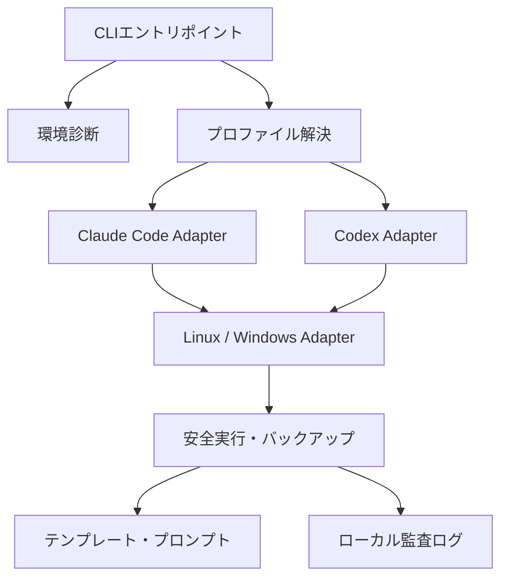

# アーキテクチャ

## 論理構成

## コンポーネント一覧

| ID | コンポーネント | 実装 |
|---|---|---|
| CMP-01 | Environment Detector | `scripts/linux/diagnose.sh` / `scripts/windows/Test-Environment.ps1` |
| CMP-02 | Profile Resolver | 各ツールの `common/profiles/` + ローカル `profile.yml` |
| CMP-03 | Claude Adapter | `claude-code/` |
| CMP-04 | Codex Adapter | `codex/` |
| CMP-05 | OS Adapter | `scripts/linux/lib/` / `scripts/windows/Modules/` |
| CMP-06 | Safe Executor | `scripts/linux/bootstrap.sh` / `scripts/windows/Bootstrap.ps1` |
| CMP-07 | Prompt Manager | `prompts/` + `scripts/validation/validate-prompts.mjs` |
| CMP-08 | Template Renderer | `scripts/linux/render-template.sh` / `scripts/windows/New-ProjectFromTemplate.ps1` |
| CMP-09 | Audit Logger | `common/config/logging.yml` + 各スクリプトの監査ログ出力 |
| CMP-10 | Migration Registry | `docs/migration/inventory.yml` + `scripts/validation/validate-migration.mjs` |

## 依存方向

- ツール固有層（`claude-code` / `codex`）は共通層（`common/`、`scripts/linux/lib`、`scripts/windows/Modules`）を参照してよい。
- OS 固有層は共通インターフェースを実装する。
- 共通層からツール固有層を直接参照しない。
- テンプレートとプロンプトは実行スクリプトへ依存しない。
